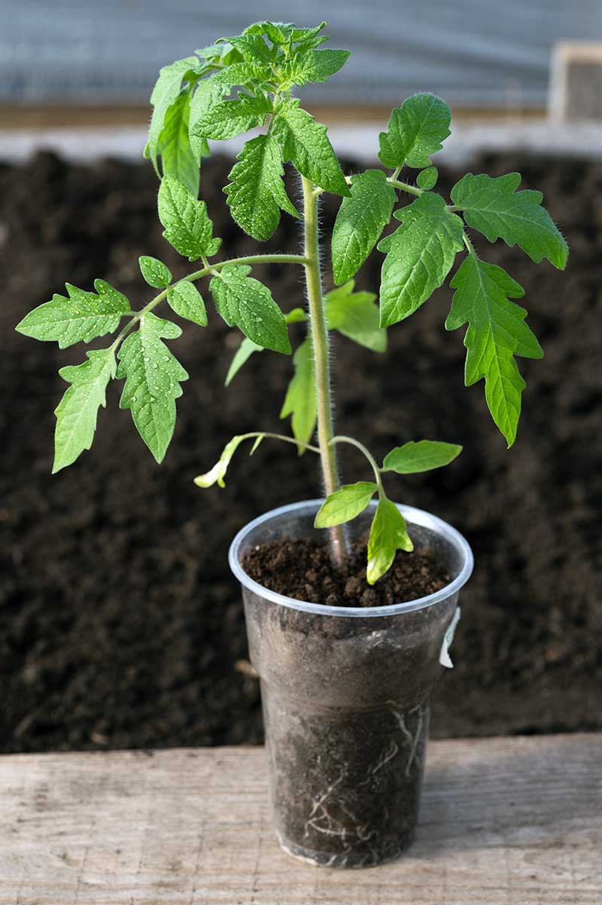

# Research Plant Growth AI

The Research Plant Growth AI takes care of your plants by automatically capturing pictures, tracking growth stages, and collaborating with researchers. It creates reports, supports multiple users, and sends alerts, even detecting diseases early for better plant health.



## Features

1. **Automated Schedule:** Set up automated schedules for capturing images at predetermined intervals to consistently monitor and timestamp your plants.

2. **Capture Timestamping:** Automatically timestamp images of your plants for accurate temporal tracking of growth.

3. **Growth Analysis:** Track essential plant growth stages, such as fruiting, vegetative, or harvest, based on the timestamped images.

4. **Defects Detection:** Utilize advanced analysis techniques to identify potential plant diseases or infections, considering factors like leaf discoloration and abnormalities.

5. **Notifications:** Receive alerts about important daily abnormalities or issues with plant health, keeping you informed about your timestamped plants' well-being.

6. **User Management:** Support multiple user accounts with varying access levels and permissions to ensure privacy and collaboration for admins and researchers.

7. **Research Hub:** Enable other researchers to provide remarks on plant analyses submitted by users.

8. **Report Generation:** Generate growth reports with interactive graphs to facilitate the visualization of daily predicted plant data.

## Getting Started

Follow these steps to get started with Research Plant Growth AI:

1. **Download the Repository:**

   ```shell
   git clone https://github.com/bckyrd/research-plant-growth-ai.git

   ```

2. **Create sql db:**

   ```shell
   db_python

   ```

3. **or install library dependandancies:**

   ```shell
   python.exe -m pip install --upgrade pip && pip install fastapi sqlalchemy passlib pydantic uvicorn opencv-python Pillow python-jose enum34 uuid mysql-connector-python python-multipart psycopg2-binary bcrypt tensorflow

   ```

4. **enter api folder:**

   ```shell
   cd fastapi-growth-ai

   ```

5. **run the api:**

   ```shell
   uvicorn --reload main:app

   ```

6. **start using from this page:**
   ```shell
   index.html
   ```
